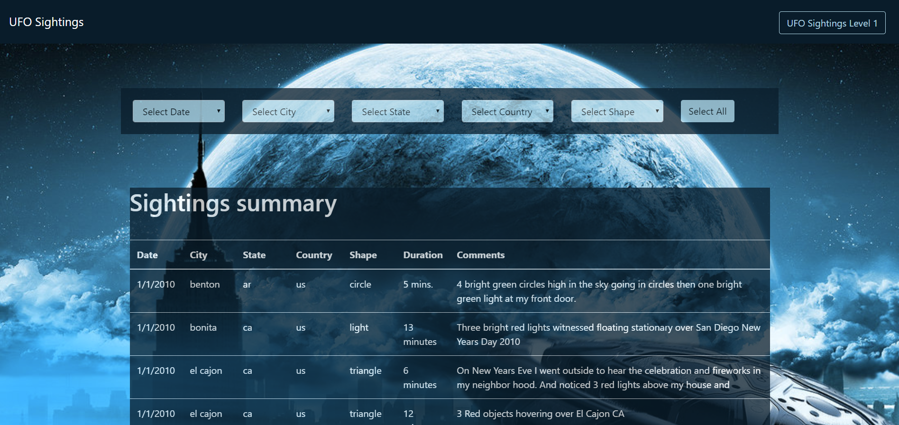

Week 14: Introduction into JavaScript

The UFO Sightings website makes use of a data script that contains about 2 weeks worth of UFO Sightings within the USA. A slick starter page was provided, but I didn't use it and started building mine from scratch. The assignment was split between level 1 and level 2. Both levels are incorporated into one website. Please start it here: [UFO Sightings](https://dutchds.github.io/UFO-Level-1-and-2/index.html) or clone this repo.

The page starts out on a landing page:

 

Level 1: Displays all available data and has the option to filter by date. A dropdown with available dates was created for ease of use, however, the 'Search for Specific Date' button still needs to be pushed.

 

Level 2: When loading this page, all 5 dropdown boxes are filled with the unique values found in the data.js script. The user can then keep drilling down or changing different filters. A reset button is added to start over.

 

